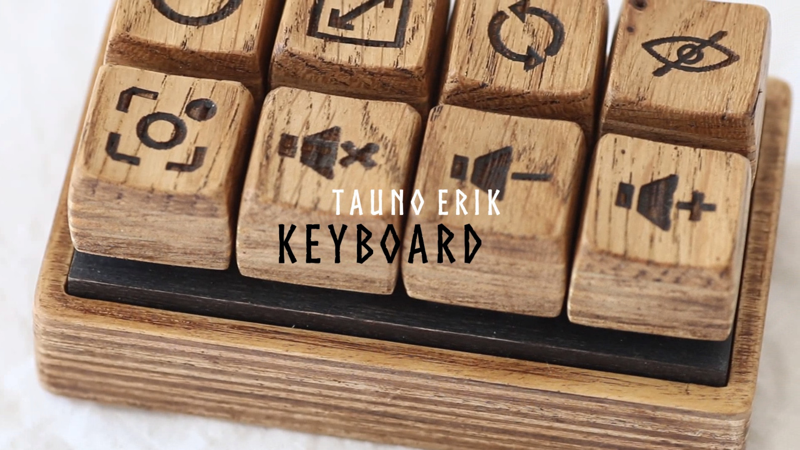
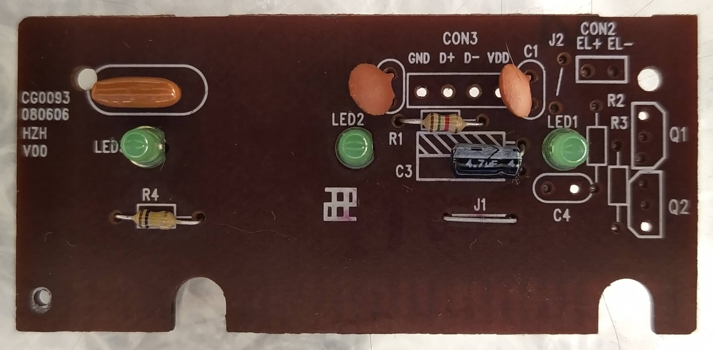
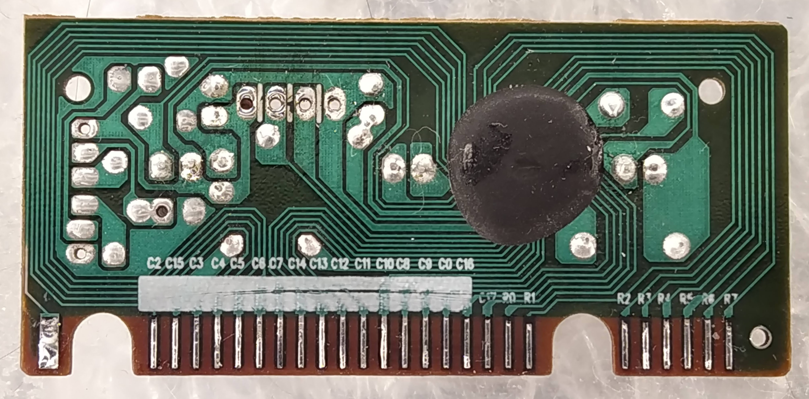
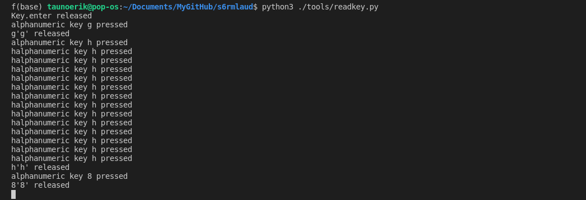
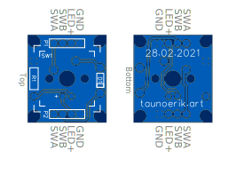

# Sõrmlaud

I had one old and cheap rubber dome keyboard with missing keys. So I take it apart and found this controller PCB board. The board pads were coated with graphite. I removed it and soldered wires on it. And put it on a breadboard. Then I mapped all rows and column combinations to find what scancode they output. For this, I have the python script to display which key is pressed.

Then I designed PCB for one switch. It is with breadboard friendly layout and uses through-hole components. And made a plywood mounting plate, stained it black and lacquered. I connected the buttons through the mounting plate to the circuit boards.

Then I figured out which buttons I wanted and soldered right C and R wires in the right places.

I also made a plywood case.

The next part was keycaps. I could use plastic ones. But I wanted them to be symmetrical and with symbols on them. So again I made them from plywood. The top layer is solid oak. Other is birch tree plywood. Laser cutting them and glued together. One part is 3D printed. Cross shape part that connects keycaps to switches. The hardest part was sanding the keycaps to the right shape. I did it by hand, but it should be mechanized process. And also my keycaps are larger than normal keycaps on the keyboard.

All wooden parts are finished with Liberon Black Bison Antikvax.

## Keyboard controller PCB

The USB keyboard PCB has 8 row (R0 - R7 ) and 18 column pins (C0 - C17).

## Tools

Python script readkey.py to read keyboard inputs.

Install requirements:

    pip3 install python3-xlib pynput

Run:

    python3 ./tools/readkey.py 

## Maping

Maping Rows and Columns.

 x |R0         |R1       |R2     |R3               |R4              |R5        |R6               |R7
---|-----------|---------|-------|-----------------|----------------|----------|-----------------|---
C1 |pause      |tab      |a      |esc              |z               |65314     |ˇ                |1
C2 |q          |caps_lock|s      |<                |x               |65315     |f1               |2
C15|w          |shift    |shift_r|media_volume_down|media_volume_up |media_next|media_prev       |Tools
C3 |e          |f3       |d      |f4               |c               |65319     |f2               |3
C4 |r          |t        |f      |g                |v               |b         |5                |4
C5 |u          |y        |j      |h                |m               |n         |6                |7
C6 |i          |õ        |k      |f6               |,               |<0>       |'                |8
C7 |o          |f7       |l      |                 |.               |menu      |f8               |9
C14|+          |.        |enter  |up               |media_play_pause|left      |home             |end
C13|scroll_lock|6        |3      |.                |*               |-         |page_up          |page_down
C12|8          |65437    |2      |0                |/               |right     |insert           |Sleep
C11|7          |4        |1      |space            |num_lock        |down      |delete           |PowerOff
C10|<0>        |backspace|'      |f11              |enter           |f12       |f9               |f10
C8 |p          |ü        |ö      |ä                |'               |-         |+                |0
C9 |scroll_lock|0        |       |alt              |                |65027     |0                |print_screen
C0 |pause      |PowerOff |alt    |Sleep            |ctrl_r          |WakeUp    |ctrl             |f5
C16|Mail       |cmd (win)|Forward|Cancel           |Back            |269025039 |media_volume_mute|Search
C17|65332      |Favorites|cmd_r  |Explorer         |AudioStop       |Calculator|HomePage         |65329

Decimal|Hex|name
---|---|---
65027|0xfe03    |ISO_Level3_Shift
65314|0xff22    |Muhenkan
65315|0xff23    |Henkan_Mode
65319|0xff27    |Hiragana_Katakana
65329|0xff31    |Hangul	
65332|0xff34    |Hangul_Hanja
65437|0xff9d    |KP_Begin
65385|0xff69    |Cancel
269025039|          |
269025045|0x1008ff15|XF86AudioStop
269025048|0x1008ff18|XF86HomePage
269025049|0x1008ff19|XF86Mail
269025051|0x1008ff1b|XF86Search
269025153|0x1008ff81|XF86Tools
269025062|0x1008ff26|XF86Back
269025063|0x1008ff27|XF86Forward
269025066|0x1008ff2a|XF86PowerOff
269025067|0x1008ff2b|XF86WakeUp
269025071|0x1008ff2f|XF86Sleep
269025072|0x1008ff30|XF86Favorites
269025117|0x1008ff5d|XF86Explorer
269025053|0x1008ff1d|XF86Calculator

## Dump the keyboard layout

Dump the keyboard layout from the console:

    xmodmap -pk >ConsolekbLayout.txt

## Custom switch PCB

0. PCB
   
1. Signal Diode **1N4148** Fast switching diode
2. Resistor 120Ω 1/6W

## Connect

Row -> SWA
Col -> SWB

## Links

- Ben Eater [So how does a PS/2 keyboard interface work?](https://www.youtube.com/watch?v=7aXbh9VUB3U)
- USB HID Keyboard scan codes as per USB spec 1.11 [usb_hid_keys.h](doc/usb_hid_keys.h)
- Windows Keyboard Scan Code Specification [usb_scancode.odf](doc/usb_scancode.odt)
- [Custom Wooden Mechanical Keyboard](https://taunoerik.art/2021/05/02/custom-wooden-mechanical-keyboard/)

__

Copyright Tauno Erik 2021 [taunoerik.art](https://taunoerik.art/)
